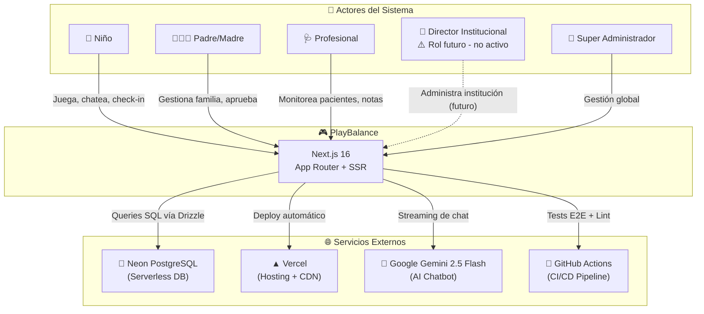
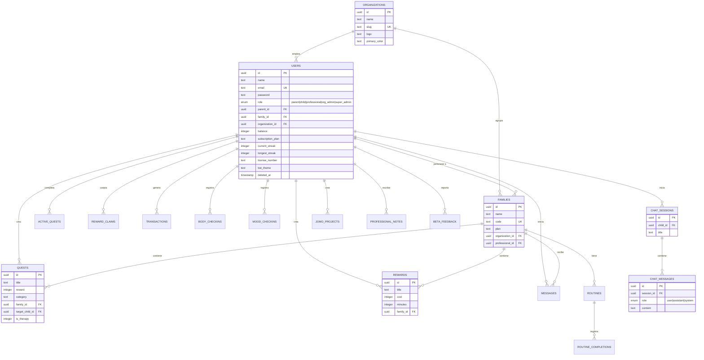
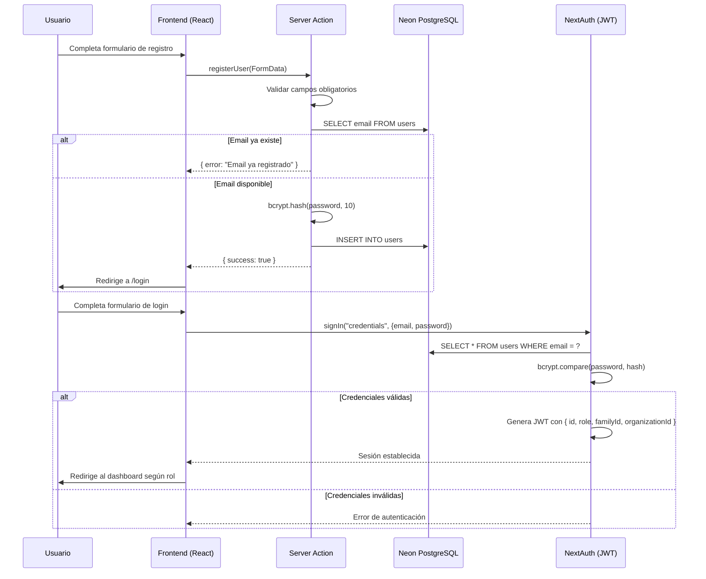
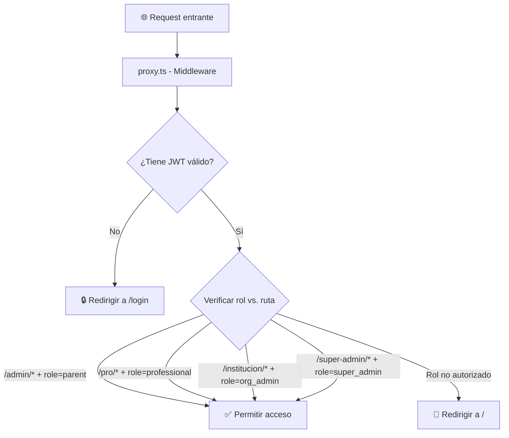
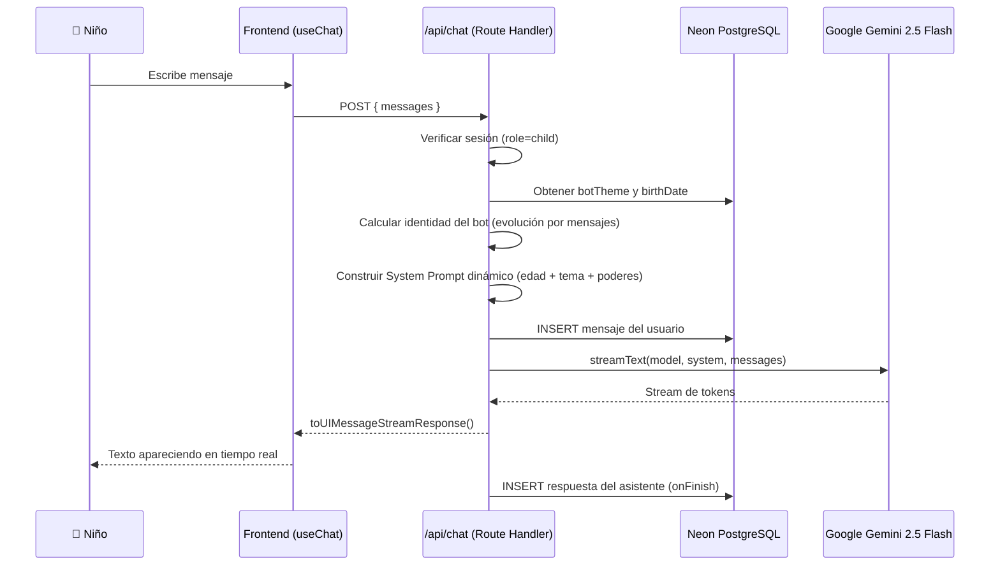
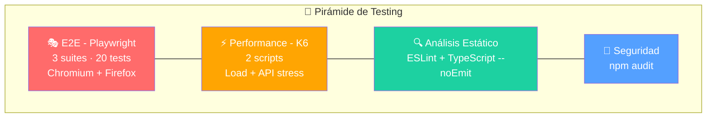
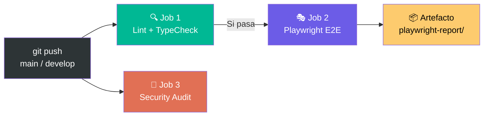

# Software Design Document (SDD)
## PlayBalance — Sistema de Bienestar Digital para Niños

| Campo | Valor |
|---|---|
| **Proyecto** | PlayBalance |
| **Versión del documento** | 1.0 |
| **Fecha** | 2026-07-01 |
| **Autor** | Fernando Ferreyra |
| **Estándar aplicado** | IEEE 1016-2009 (IEEE Standard for Information Technology — Software Design Descriptions) |

---

> [!NOTE]
> Este documento sigue la estructura del estándar **IEEE 1016-2009**, el marco de referencia más utilizado en la industria para describir el diseño de sistemas de software. El estándar define **viewpoints** (puntos de vista) que organizan la información según la audiencia: contexto, composición, lógica, dependencias e interfaz.

---

## 1. Introducción

### 1.1 Propósito
Este documento describe la arquitectura, los componentes, el modelo de datos, los flujos de usuario y las decisiones de diseño del sistema **PlayBalance**. Su objetivo es servir como referencia técnica para desarrolladores, testers QA y stakeholders que necesiten comprender cómo está construido el sistema sin leer el código fuente.

### 1.2 Alcance
PlayBalance es una plataforma web de **bienestar digital para niños** que gamifica el equilibrio entre el tiempo de pantalla y las actividades offline. El sistema permite a las familias crear misiones, otorgar recompensas y hacer seguimiento emocional, mientras que profesionales de la salud (psicólogos, terapeutas, educadores) pueden monitorear a sus pacientes de forma remota.

### 1.3 Definiciones y Acrónimos

| Término | Definición |
|---|---|
| **ORM** | Object-Relational Mapping. Capa de abstracción entre el código y la base de datos. |
| **JWT** | JSON Web Token. Estándar de autenticación basado en tokens firmados. |
| **E2E** | End-to-End. Pruebas que simulan el comportamiento completo del usuario. |
| **SSR** | Server-Side Rendering. Renderizado de páginas en el servidor antes de enviarlas al cliente. |
| **CI/CD** | Continuous Integration / Continuous Delivery. Automatización del ciclo de vida del software. |
| **RBAC** | Role-Based Access Control. Control de acceso basado en roles. |
| **SPA** | Single Page Application. Aplicación de una sola página con navegación client-side. |
| **POM** | Page Object Model. Patrón de diseño para tests E2E. |

### 1.4 Referencias
- [IEEE 1016-2009](https://standards.ieee.org/standard/1016-2009.html) — IEEE Standard for Software Design Descriptions
- [Next.js 16 Documentation](https://nextjs.org/docs)
- [Drizzle ORM Documentation](https://orm.drizzle.team/docs/overview)
- [Playwright Documentation](https://playwright.dev/docs/intro)

---

## 2. Viewpoint de Contexto (Context Viewpoint)

### 2.1 Diagrama de Contexto del Sistema



### 2.2 Roles del Sistema (RBAC)

PlayBalance implementa un modelo de **Control de Acceso Basado en Roles (RBAC)** con 5 roles jerárquicos:

| Rol | Código interno | Permisos principales |
|---|---|---|
| 🧒 Niño | `child` | Chat con IA, check-ins corporales y emocionales, completar misiones, canjear recompensas, proyectos JOMO |
| 👨‍👩‍👧 Padre/Madre | `parent` | Crear/aprobar misiones y recompensas, ver métricas, gestionar hijos, rutinas, mensajería |
| 🩺 Profesional | `professional` | Monitorear familias asignadas, notas clínicas, crear misiones terapéuticas, métricas avanzadas |
| 🏢 Director Institucional | `org_admin` | ⚠️ **Rol no activo.** La arquitectura (tabla `organizations`, ruta `/institucion`, middleware RBAC y Server Action `org.ts`) está preparada para gestionar clínicas/escuelas en una versión futura. |
| 👑 Super Administrador | `super_admin` | Panel global, gestión de todos los usuarios, métricas de plataforma, feedback |

---

## 3. Viewpoint de Composición (Composition Viewpoint)

### 3.1 Stack Tecnológico

| Capa | Tecnología | Versión | Justificación |
|---|---|---|---|
| **Framework** | Next.js (App Router) | 16.2.6 | SSR + API Routes integradas, rendimiento SEO, arquitectura híbrida |
| **Lenguaje** | TypeScript | 5.x | Tipado estático, prevención de errores en compile-time |
| **ORM** | Drizzle ORM | 0.45.2 | Type-safe, ligero, soporte nativo para PostgreSQL serverless |
| **Base de Datos** | Neon PostgreSQL | Serverless | Escalado automático, conexión vía WebSocket, cero mantenimiento |
| **Autenticación** | NextAuth.js | 4.24.14 | Integración nativa con Next.js, soporte JWT + Credentials |
| **IA Conversacional** | Google Gemini 2.5 Flash | via AI SDK | Modelo multimodal rápido, streaming de respuestas |
| **UI Framework** | React | 19.2.4 | Componentes declarativos, Server Components |
| **Animaciones** | Framer Motion | 12.38.0 | Animaciones declarativas de alto rendimiento |
| **Gráficos** | Recharts | 3.8.1 | Visualización de datos interactiva (métricas de bienestar) |
| **Hosting** | Vercel | Edge Network | Deploy automático desde Git, CDN global, serverless functions |
| **CI/CD** | GitHub Actions | N/A | Pipeline automatizado de calidad (Lint, TypeCheck, E2E, Security) |
| **Testing E2E** | Playwright | 1.61.0 | Multi-browser (Chromium + Firefox), POM pattern |
| **Testing Perf** | K6 (Grafana) | N/A | Load testing y stress testing de APIs |

### 3.2 Estructura del Proyecto

```
play-balance/
├── .github/workflows/          # Pipeline CI/CD (GitHub Actions)
│   └── qa-ci.yml               # Lint → TypeCheck → E2E → Security Audit
├── docs/                       # Documentación técnica
│   ├── design/                 # ← Este documento (SDD)
│   └── qa/                     # Reportes de QA y performance
├── e2e/                        # Tests End-to-End (Playwright)
│   ├── pages/                  # Page Objects (POM Pattern)
│   │   ├── BasePage.ts         # Clase base con navegación compartida
│   │   ├── LandingPage.ts      # Selectores de la landing
│   │   └── RegisterPage.ts     # Selectores del formulario de registro
│   └── tests/                  # Archivos de especificación (.spec.ts)
│       ├── landing.spec.ts     # Tests de la página principal
│       ├── register-familia.spec.ts      # Tests de registro de familias
│       └── register-profesional.spec.ts  # Tests de registro de profesionales
├── performance/                # Scripts de carga (K6)
│   ├── api-test.ts             # Test de endpoints individuales
│   └── load-test.ts            # Test de carga concurrente
├── scripts/                    # Utilidades de BD
│   └── seed-test-data.ts       # Seed de datos para CI
├── src/
│   ├── app/                    # App Router de Next.js
│   │   ├── actions/            # Server Actions (lógica de negocio)
│   │   │   ├── auth.ts         # Registro de usuarios
│   │   │   ├── approvals.ts    # Aprobación de misiones/recompensas
│   │   │   ├── chat.ts         # Gestión de sesiones de chat
│   │   │   ├── checkin.ts      # Check-ins corporales y emocionales
│   │   │   ├── family.ts       # CRUD de familias y miembros
│   │   │   ├── feedback.ts     # Widget de feedback beta
│   │   │   ├── jomo.ts         # Proyectos JOMO (Joy of Missing Out)
│   │   │   ├── messages.ts     # Mensajería familia ↔ profesional
│   │   │   ├── org.ts          # Gestión institucional
│   │   │   ├── player.ts       # Perfil y estado del niño
│   │   │   ├── pro.ts          # Acciones del profesional
│   │   │   ├── proMetrics.ts   # Métricas del panel profesional
│   │   │   ├── proStats.ts     # Estadísticas avanzadas
│   │   │   ├── quests.ts       # CRUD de misiones
│   │   │   ├── rewards.ts      # CRUD de recompensas
│   │   │   ├── routines.ts     # Rutinas familiares
│   │   │   ├── suggestions.ts  # Sugerencias de los niños
│   │   │   └── super-admin.ts  # Panel de super administración
│   │   ├── api/                # API Routes
│   │   │   ├── auth/[...nextauth]/ # Endpoint de NextAuth
│   │   │   ├── chat/           # Streaming de chat con Gemini
│   │   │   └── health/         # Health check para monitoreo
│   │   ├── admin/              # Dashboard del padre/madre
│   │   ├── pro/                # Dashboard del profesional
│   │   ├── institucion/        # Dashboard institucional
│   │   ├── super-admin/        # Dashboard del super admin
│   │   ├── register/           # Página de registro
│   │   ├── login/              # Página de login
│   │   └── ...                 # Otras rutas (goodbye, privacidad, etc.)
│   ├── components/             # Componentes React reutilizables
│   │   ├── Dashboards.tsx      # Dashboards de todos los roles (74KB)
│   │   ├── LandingPage.tsx     # Landing page principal
│   │   ├── FeedbackWidget.tsx  # Widget flotante de feedback
│   │   ├── AvatarSelector.tsx  # Selector de avatar para niños
│   │   ├── UpgradeModal.tsx    # Modal de planes premium
│   │   └── providers.tsx       # Provider de sesión NextAuth
│   ├── db/                     # Capa de datos
│   │   ├── index.ts            # Conexión a Neon vía WebSocket
│   │   └── schema.ts           # Esquema completo (Drizzle ORM)
│   ├── lib/                    # Utilidades compartidas
│   │   └── auth.ts             # Configuración de NextAuth + JWT
│   └── proxy.ts                # Middleware de autorización (RBAC)
├── playwright.config.ts        # Config de Playwright (local)
├── playwright.staging.config.ts # Config de Playwright (staging/producción)
├── drizzle.config.ts           # Config de Drizzle Kit (migraciones)
├── package.json                # Dependencias y scripts
└── tsconfig.json               # Configuración de TypeScript
```

---

## 4. Viewpoint Lógico (Logical Viewpoint)

### 4.1 Modelo de Datos (Diagrama Entidad-Relación)



### 4.2 Tablas del Sistema

El esquema contiene **17 tablas** organizadas por dominio funcional:

| Dominio | Tablas | Propósito |
|---|---|---|
| **Identidad** | `users`, `accounts`, `sessions`, `verification_tokens` | Autenticación, sesiones JWT, verificación de email |
| **Estructura** | `organizations`, `families` | Jerarquía organizacional (institución → familia → miembros) |
| **Gamificación** | `quests`, `active_quests`, `rewards`, `reward_claims`, `transactions` | Sistema de misiones, recompensas y economía virtual (tokens) |
| **Bienestar** | `body_checkins`, `mood_checkins`, `routines`, `routine_completions` | Seguimiento emocional, corporal y rutinas |
| **Comunicación** | `messages`, `professional_notes`, `chat_sessions`, `chat_messages` | Mensajería interna y chat con IA |
| **Creatividad** | `jomo_projects` | Proyectos offline (Joy of Missing Out) |
| **Operaciones** | `beta_feedback` | Retroalimentación de usuarios beta |

---

## 5. Viewpoint de Dependencias (Dependency Viewpoint)

### 5.1 Flujo de Autenticación



### 5.2 Flujo del Middleware de Autorización (RBAC)



### 5.3 Flujo del Chat con IA (Gemini)



> [!IMPORTANT]
> El chatbot **evoluciona** según la cantidad de mensajes enviados por el niño. Cada tema (botánico, espacial, deportivo, misterio) tiene 5 niveles de identidad con personalidades y poderes distintos. El system prompt se reconstruye dinámicamente en cada request.

---

## 6. Viewpoint de Interfaz (Interface Viewpoint)

### 6.1 Rutas de la Aplicación

| Ruta | Tipo | Rol requerido | Descripción |
|---|---|---|---|
| `/` | Dinámica (SSR) | Público / Autenticado | Landing page o dashboard según sesión |
| `/login` | Dinámica | Público | Formulario de inicio de sesión |
| `/register` | Dinámica | Público | Formulario de registro multi-rol |
| `/admin` | Dinámica | `parent` | Dashboard familiar (misiones, recompensas, hijos) |
| `/pro` | Dinámica | `professional` | Dashboard profesional (pacientes, notas, métricas) |
| `/pro/family/[familyId]` | Dinámica | `professional` | Vista detallada de una familia asignada |
| `/institucion` | Dinámica | `org_admin` | Dashboard institucional |
| `/super-admin` | Dinámica | `super_admin` | Panel de administración global |
| `/goodbye` | Dinámica | Autenticado | Flujo de baja / pausa de cuenta |
| `/welcome-back` | Dinámica | Autenticado | Reactivación de cuenta pausada |
| `/privacidad` | Dinámica | Público | Política de privacidad |
| `/terminos` | Dinámica | Público | Términos y condiciones |
| `/api/auth/[...nextauth]` | API Route | N/A | Endpoints de NextAuth (signIn, signOut, session) |
| `/api/chat` | API Route | `child` | Streaming de chat con Gemini |
| `/api/health` | API Route | Público | Health check para monitoreo y CI/CD |

### 6.2 Server Actions (Lógica de Negocio)

La lógica de negocio se ejecuta exclusivamente en el servidor mediante **Server Actions** de Next.js. No existe una REST API tradicional; el frontend invoca funciones del servidor directamente.

| Archivo | Funciones principales | Dominio |
|---|---|---|
| `auth.ts` | `registerUser` | Registro multi-rol con validación de matrícula |
| `family.ts` | `createFamily`, `addChild`, `hardDeleteFamilyById` | Gestión de familias y miembros |
| `quests.ts` | `createQuest`, `getQuests` | CRUD de misiones |
| `rewards.ts` | `createReward`, `getRewards` | CRUD de recompensas |
| `approvals.ts` | `approveQuest`, `approveReward` | Flujo de aprobación padre → hijo |
| `player.ts` | `getPlayerProfile`, `updateAvatar` | Perfil y estado del niño |
| `checkin.ts` | `submitBodyCheckin`, `submitMoodCheckin` | Registro de bienestar |
| `routines.ts` | `createRoutine`, `completeStep` | Rutinas familiares |
| `jomo.ts` | `createJomoProject`, `reviewProject` | Proyectos creativos offline |
| `pro.ts` | `getAssignedFamilies`, `createTherapyQuest` | Funciones del profesional |
| `proMetrics.ts` | `getProfessionalMetrics` | Métricas del panel profesional |
| `proStats.ts` | `getDetailedStats` | Estadísticas avanzadas |
| `messages.ts` | `sendMessage`, `getMessages` | Mensajería interna |
| `org.ts` | `getOrganizationData` | Gestión institucional |
| `suggestions.ts` | `createSuggestion` | Sugerencias de niños a padres |
| `feedback.ts` | `submitFeedback` | Feedback de usuarios beta |
| `super-admin.ts` | `getAllUsers`, `getGlobalStats` | Administración global |

---

## 7. Decisiones de Diseño

### 7.1 Decisiones Arquitectónicas

| Decisión | Alternativas consideradas | Justificación |
|---|---|---|
| **Next.js App Router** vs. Pages Router | Pages Router, Remix, Astro | App Router permite Server Components, streaming y Server Actions nativos. Reduce la necesidad de una API REST separada. |
| **Drizzle ORM** vs. Prisma | Prisma, TypeORM, Knex | Drizzle es más liviano, genera SQL predecible, soporta Neon serverless de forma nativa y tiene type-safety superior. |
| **Neon PostgreSQL** vs. Supabase | Supabase, PlanetScale, Railway | Neon ofrece branching de BD (ideal para CI), auto-scaling a cero, y conexión vía WebSocket sin connection pooler. |
| **Server Actions** vs. API Routes | REST API, tRPC, GraphQL | Las Server Actions eliminan el boilerplate de endpoints, la serialización manual y los problemas de CORS. El formulario envía datos directamente al servidor. |
| **JWT** vs. Sessions en BD | Database sessions, OAuth-only | JWT permite autenticación stateless, reduce queries a la BD en cada request y escala mejor en arquitectura serverless. |
| **Gemini 2.5 Flash** vs. GPT-4 | OpenAI GPT-4o, Claude, Llama | Flash ofrece el mejor balance latencia/costo para streaming conversacional. La integración con AI SDK de Vercel es nativa. |

### 7.2 Patrones de Diseño Aplicados

| Patrón | Dónde se aplica | Beneficio |
|---|---|---|
| **RBAC** (Role-Based Access Control) | `proxy.ts` + JWT claims | Seguridad declarativa a nivel de ruta |
| **Page Object Model** (POM) | `e2e/pages/*.ts` | Tests E2E mantenibles y DRY |
| **Strategy Pattern** | `getBotIdentity()` en el chat | Cada tema del bot tiene una estrategia de evolución diferente |
| **Repository Pattern** | Server Actions + Drizzle | Separa lógica de negocio del acceso a datos |
| **Adapter Pattern** | `DrizzleAdapter` en NextAuth | Integra NextAuth con el esquema personalizado de Drizzle |

---

## 8. Seguridad

### 8.1 Medidas Implementadas

| Capa | Mecanismo | Implementación |
|---|---|---|
| **Contraseñas** | bcrypt con salt factor 10 | `bcrypt.hash(password, 10)` en registro; `bcrypt.compare()` en login |
| **Autenticación** | JWT firmado con secret | `NEXTAUTH_SECRET` como clave de firma |
| **Autorización** | Middleware RBAC | `proxy.ts` valida `token.role` contra la ruta solicitada |
| **Inyección SQL** | ORM parametrizado | Drizzle genera queries con parámetros escapados automáticamente |
| **Variables sensibles** | `.env.local` + `.gitignore` | `DATABASE_URL`, `NEXTAUTH_SECRET`, `GOOGLE_GENERATIVE_AI_API_KEY` nunca se commitean |
| **Auditoría de deps** | `npm audit` en CI | Job `security` en `qa-ci.yml` corre `npm audit --audit-level=high` |
| **Chat seguro** | System prompt blindado | Reglas estrictas de comportamiento del bot (no resolver temas médicos, derivar a padres) |
| **Soft Delete** | Campo `deleted_at` | Las cuentas se "pausan" sin borrar datos, permitiendo reactivación |

### 8.2 Flujo de Variables de Entorno

```
.env.local (LOCAL — nunca se sube a Git)
    ├── DATABASE_URL          → Conexión a Neon PostgreSQL
    ├── NEXTAUTH_SECRET       → Firma de tokens JWT
    ├── NEXTAUTH_URL          → URL base de la aplicación
    └── GOOGLE_GENERATIVE_AI_API_KEY → API Key de Gemini

GitHub Secrets (CI/CD — encriptados por GitHub)
    ├── DATABASE_URL          → Mismo o diferente para CI
    └── NEXTAUTH_SECRET       → Copia del secret para tests

Vercel Environment Variables (PRODUCCIÓN — encriptadas por Vercel)
    ├── DATABASE_URL          → Producción
    ├── NEXTAUTH_SECRET       → Producción
    ├── NEXTAUTH_URL          → https://play-balance.vercel.app
    └── GOOGLE_GENERATIVE_AI_API_KEY → Producción
```

---

## 9. Estrategia de Testing

### 9.1 Pirámide de Tests



### 9.2 Suites de Tests E2E

| Suite | Archivo | Tests | Qué valida |
|---|---|---|---|
| Landing Page | `landing.spec.ts` | TEST-01 a TEST-04 | Navegación, elementos visibles, CTA funcional |
| Registro Familia | `register-familia.spec.ts` | TEST-01 a TEST-04 | Registro exitoso, validaciones HTML5, email duplicado |
| Registro Profesional | `register-profesional.spec.ts` | TEST-05 a TEST-07 | Registro con matrícula obligatoria, validaciones negativas |

### 9.3 Pipeline de CI/CD



| Job | Trigger | Depende de | Timeout |
|---|---|---|---|
| **Static Analysis** | `push` / `pull_request` a main/develop | — | Default |
| **Playwright E2E** | Mismo | Static Analysis ✅ | 15 min |
| **Security Audit** | Mismo | — | Default |

---

## 10. Despliegue y Entornos

### 10.1 Entornos Configurados

| Entorno | URL | Trigger | BD |
|---|---|---|---|
| **Local** | `http://localhost:3000` | `npm run dev` | Neon (dev branch) |
| **Staging** | `https://play-balance.vercel.app` | Deploy automático vía Vercel | Neon (main branch) |
| **CI** | Efímero (GitHub Actions) | `git push` / `pull_request` | Neon (vía secrets) |

### 10.2 Scripts Disponibles

| Comando | Acción |
|---|---|
| `npm run dev` | Servidor de desarrollo con hot reload |
| `npm run build` | Build de producción optimizado (Turbopack) |
| `npm run start` | Inicia servidor de producción local |
| `npm run lint` | Ejecuta ESLint |
| `npm run db:push` | Sincroniza schema de Drizzle → Neon |
| `npm run db:studio` | Interfaz visual de la BD (Drizzle Studio) |
| `npm run db:seed:test` | Pobla la BD con datos de prueba |
| `npm run test:staging` | Tests E2E contra producción (Vercel) |
| `npm run test:perf` | Test de carga con K6 |
| `npm run test:perf:api` | Test de stress de APIs con K6 |

---

## 11. Apéndice: Historial de Revisiones

| Versión | Fecha | Autor | Cambios |
|---|---|---|---|
| 1.0 | 2026-07-01 | Fernando Ferreyra | Creación inicial del documento |
